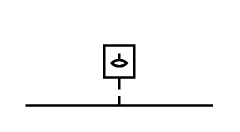

# Liquid Level Actuated On 2

## Definition

```
{
  _style: { 
    entity: 'html=1;shape=mxgraph.electrical.electro-mechanical.liquidLevelActuatedSwitch2;aspect=fixed;elSwitchState=on;',
  },
  _width: 75,
  _height: 32,
}
```

## Usage

```
import { LiquidLevelActuatedOn2 } from '@diac/standard-components-diagrams/electricalSwitchesAndRelays'

<LiquidLevelActuatedOn2/>
```

## Preview


