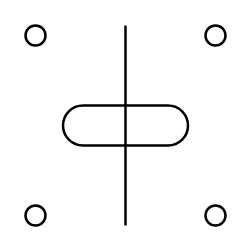

# Mercury Switch

## Definition

```
{
  _style: 'pointerEvents=1;verticalLabelPosition=bottom;shadow=0;dashed=0;align=center;html=1;verticalAlign=top;shape=mxgraph.electrical.electro-mechanical.mercury_switch;',
  _width: 80,
  _height: 80,
}
```

## Usage

```
import { MercurySwitch } from '@reactiac/standard-components-diagrams/electricalSwitchesAndRelays'

<MercurySwitch/>
```

## Preview


