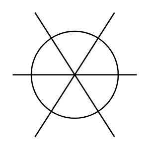

# Pilot Light

## Definition

```
{
  _style: { 
    entity: 'pointerEvents=1;verticalLabelPosition=bottom;shadow=0;dashed=0;align=center;html=1;verticalAlign=top;shape=mxgraph.electrical.electro-mechanical.pilot_light;',
  },
  _width: 60,
  _height: 60,
}
```

## Usage

```
import { PilotLight } from '@diac/standard-components-diagrams/electricalSwitchesAndRelays'

<PilotLight/>
```

## Preview


