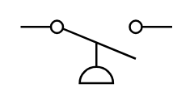

# Pressure Actuated Off

## Definition

```
{
  _style: { 
    entity: 'html=1;shape=mxgraph.electrical.electro-mechanical.pressureActuatedSwitch;aspect=fixed;elSwitchState=off;',
  },
  _original_width: 75,
  _original_height: 31,
}
```

## Usage

```
import { PressureActuatedOff } from '@diac/standard-components-diagrams/electricalSwitchesAndRelays'

<PressureActuatedOff/>
```

## Preview


