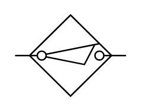

# Proximity Limit Switch Off

## Definition

```
{
  _style: 'pointerEvents=1;verticalLabelPosition=bottom;shadow=0;dashed=0;align=center;html=1;verticalAlign=top;shape=mxgraph.electrical.electro-mechanical.proximityLimitSwitch2;elSwitchState=off;',
  _width: 75,
  _height: 55,
}
```

## Usage

```
import { ProximityLimitSwitchOff } from '@diac/standard-components-diagrams/electricalSwitchesAndRelays'

<ProximityLimitSwitchOff/>
```

## Preview


