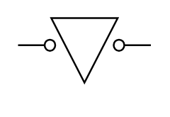

# Safety Interlock Off

## Definition

```
{
  _style: 'html=1;shape=mxgraph.electrical.electro-mechanical.safetyInterlockSwitch;aspect=fixed;elSwitchState=off;',
  _width: 75,
  _height: 45,
}
```

## Usage

```
import { SafetyInterlockOff } from '@diac/standard-components-diagrams/electricalSwitchesAndRelays'

<SafetyInterlockOff/>
```

## Preview


