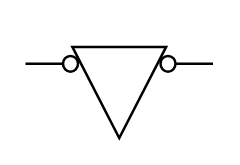

# Safety Interlock On

## Definition

```
{
  _style: { 
    entity: 'html=1;shape=mxgraph.electrical.electro-mechanical.safetyInterlockSwitch;aspect=fixed;elSwitchState=on;',
  },
  _original_width: 75,
  _original_height: 45,
}
```

## Usage

```
import { SafetyInterlockOn } from '@diac/standard-components-diagrams/electricalSwitchesAndRelays'

<SafetyInterlockOn/>
```

## Preview


