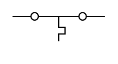

# Temperature Actuated On

## Definition

```
{
  _style: 'html=1;shape=mxgraph.electrical.electro-mechanical.temperatureActuatedSwitch;aspect=fixed;elSwitchState=on;',
  _width: 75,
  _height: 31,
}
```

## Usage

```
import { TemperatureActuatedOn } from '@reactiac/standard-components-diagrams/electricalSwitchesAndRelays'

<TemperatureActuatedOn/>
```

## Preview


