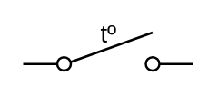

# Thermostat Off

## Definition

```
{
  _style: { 
    entity: 'html=1;shape=mxgraph.electrical.electro-mechanical.thermostat2;aspect=fixed;elSwitchState=off;',
  },
  _width: 75,
  _height: 21,
}
```

## Usage

```
import { ThermostatOff } from '@diac/standard-components-diagrams/electricalSwitchesAndRelays'

<ThermostatOff/>
```

## Preview


