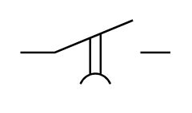

# Time Delay Make 2

## Definition

```
{
  _style: { 
    entity: 'pointerEvents=1;verticalLabelPosition=bottom;shadow=0;dashed=0;align=center;html=1;verticalAlign=top;shape=mxgraph.electrical.electro-mechanical.timeDelaySwitch2;elSwitchState=off;',
  },
  _width: 75,
  _height: 36,
}
```

## Usage

```
import { TimeDelayMake2 } from '@diac/standard-components-diagrams/electricalSwitchesAndRelays'

<TimeDelayMake2/>
```

## Preview


