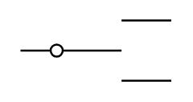

# Two Way Contact

## Definition

```
{
  _style: 'pointerEvents=1;verticalLabelPosition=bottom;shadow=0;dashed=0;align=center;html=1;verticalAlign=top;shape=mxgraph.electrical.electro-mechanical.twoWayContact2;elSwitchState=neutral;',
  _width: 75,
  _height: 30,
}
```

## Usage

```
import { TwoWayContact } from '@reactiac/standard-components-diagrams/electricalSwitchesAndRelays'

<TwoWayContact/>
```

## Preview


