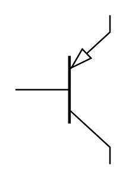

# BJT (PNP) 2

## Definition

```
{
  _style: 'verticalLabelPosition=bottom;shadow=0;dashed=0;align=center;html=1;verticalAlign=top;shape=mxgraph.electrical.transistors.pnp_transistor_5;',
  _width: 64,
  _height: 100,
}
```

## Usage

```
import { BjtPnp2 } from '@diac/standard-components-diagrams/electricalTransistors'

<BjtPnp2/>
```

## Preview


