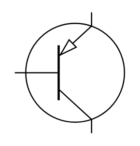

# BJT (PNP)

## Definition

```
{
  _style: 'verticalLabelPosition=bottom;shadow=0;dashed=0;align=center;html=1;verticalAlign=top;shape=mxgraph.electrical.transistors.pnp_transistor_1;',
  _width: 95,
  _height: 100,
}
```

## Usage

```
import { BjtPnp } from '@reactiac/standard-components-diagrams/electricalTransistors'

<BjtPnp/>
```

## Preview


