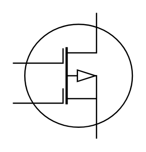

# Dual Gate MOSFET (P)

## Definition

```
{
  _style: { 
    entity: 'verticalLabelPosition=bottom;shadow=0;dashed=0;align=center;html=1;verticalAlign=top;shape=mxgraph.electrical.mosfets1.dual_gate_mosfet_p;',
  },
  _original_width: 95,
  _original_height: 100,
}
```

## Usage

```
import { DualGateMosfetP } from '@diac/standard-components-diagrams/electricalTransistors'

<DualGateMosfetP/>
```

## Preview


