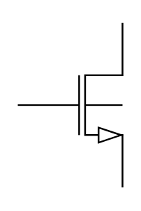

# NMOS with Bulk

## Definition

```
{
  _style: { 
    entity: 'verticalLabelPosition=bottom;shadow=0;dashed=0;align=center;html=1;verticalAlign=top;shape=mxgraph.electrical.transistors.nmos_bulk;pointerEvents=1;',
  },
  _original_width: 60,
  _original_height: 100,
}
```

## Usage

```
import { NmosWithBulk } from '@diac/standard-components-diagrams/electricalTransistors'

<NmosWithBulk/>
```

## Preview


