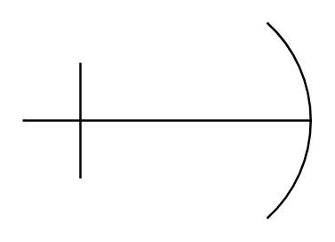

# Anticreepage Device

## Definition

```
{
  _style: 'verticalLabelPosition=bottom;shadow=0;dashed=0;align=center;html=1;verticalAlign=top;shape=mxgraph.electrical.transmission.anticreepage_device;pointerEvents=1;',
  _width: 130,
  _height: 88,
}
```

## Usage

```
import { AnticreepageDevice } from '@diac/standard-components-diagrams/electricalTransmissionPaths'

<AnticreepageDevice/>
```

## Preview


