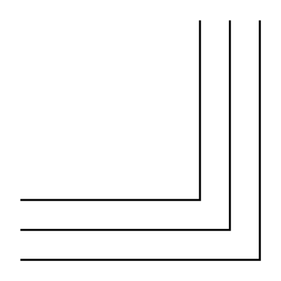

# 3-Line Bus Elbow

## Definition

```
{
  _style: 'verticalLabelPosition=bottom;shadow=0;dashed=0;align=center;html=1;verticalAlign=top;shape=mxgraph.electrical.transmission.threeLineBusElbow;notch=30;',
  _width: 120,
  _height: 120,
}
```

## Usage

```
import { Component3LineBusElbow } from '@reactiac/standard-components-diagrams/electricalTransmissionPaths'

<Component3LineBusElbow/>
```

## Preview


