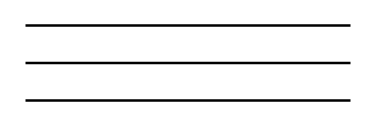

# 3-Line Bus

## Definition

```
{
  _style: { 
    entity: 'verticalLabelPosition=bottom;shadow=0;dashed=0;align=center;html=1;verticalAlign=top;shape=mxgraph.electrical.transmission.3_line_bus;',
  },
  _original_width: 130,
  _original_height: 30,
}
```

## Usage

```
import { Component3LineBus } from '@diac/standard-components-diagrams/electricalTransmissionPaths'

<Component3LineBus/>
```

## Preview


