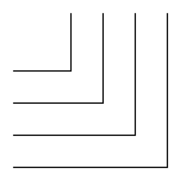

# 4-Line Bus Elbow

## Definition

```
{
  _style: 'verticalLabelPosition=bottom;shadow=0;dashed=0;align=center;html=1;verticalAlign=top;shape=mxgraph.electrical.transmission.fourLineBusElbow;notch=75;',
  _width: 120,
  _height: 120,
}
```

## Usage

```
import { Component4LineBusElbow } from '@diac/standard-components-diagrams/electricalTransmissionPaths'

<Component4LineBusElbow/>
```

## Preview


