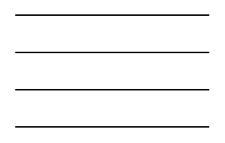

# 4-Line Bus

## Definition

```
{
  _style: 'verticalLabelPosition=bottom;shadow=0;dashed=0;align=center;html=1;verticalAlign=top;shape=mxgraph.electrical.transmission.4_line_bus;',
  _width: 130,
  _height: 75,
}
```

## Usage

```
import { Component4LineBus } from '@reactiac/standard-components-diagrams/electricalTransmissionPaths'

<Component4LineBus/>
```

## Preview


