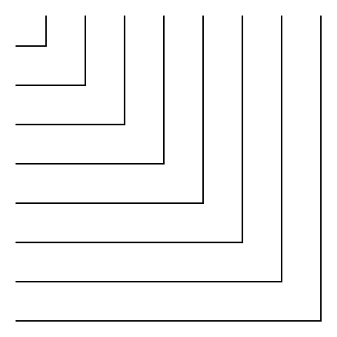

# 8-Line Bus Elbow

## Definition

```
{
  _style: 'verticalLabelPosition=bottom;shadow=0;dashed=0;align=center;html=1;verticalAlign=top;shape=mxgraph.electrical.transmission.eightLineBusElbow;notch=180;',
  _width: 200,
  _height: 200,
}
```

## Usage

```
import { Component8LineBusElbow } from '@diac/standard-components-diagrams/electricalTransmissionPaths'

<Component8LineBusElbow/>
```

## Preview


