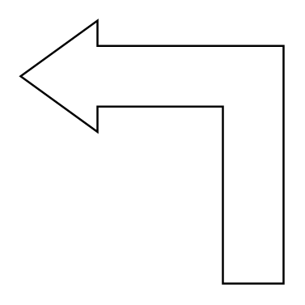

# Elbow Bus 2

## Definition

```
{
  _style: { 
    entity: 'html=1;shadow=0;dashed=0;align=center;verticalAlign=middle;shape=mxgraph.arrows2.bendArrow;dy=15;dx=38;notch=0;arrowHead=55;rounded=0;strokeWidth=1;flipH=1;',
  },
  _width: 130,
  _height: 130,
}
```

## Usage

```
import { ElbowBus2 } from '@diac/standard-components-diagrams/electricalTransmissionPaths'

<ElbowBus2/>
```

## Preview


