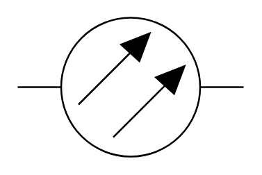

# Optical Fiber

## Definition

```
{
  _style: { 
    entity: 'verticalLabelPosition=bottom;shadow=0;dashed=0;align=center;html=1;verticalAlign=top;shape=mxgraph.electrical.transmission.optical_fiber2;',
  },
  _width: 130,
  _height: 80,
}
```

## Usage

```
import { OpticalFiber } from '@diac/standard-components-diagrams/electricalTransmissionPaths'

<OpticalFiber/>
```

## Preview


