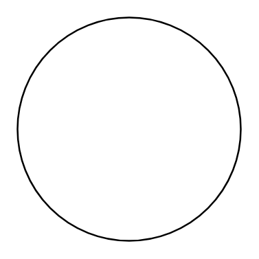

# Terminal 2

## Definition

```
{
  _style: 'verticalLabelPosition=middle;shadow=0;dashed=0;align=center;html=1;verticalAlign=middle;strokeWidth=1;shape=ellipse;fontSize=50;fontStyle=1;perimeter=ellipsePerimeter;whiteSpace=wrap;',
  _width: 130,
  _height: 130,
}
```

## Usage

```
import { Terminal2 } from '@reactiac/standard-components-diagrams/electricalTransmissionPaths'

<Terminal2/>
```

## Preview


