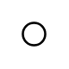

# Terminal

## Definition

```
{
  _style: 'verticalLabelPosition=bottom;shadow=0;dashed=0;align=center;html=1;verticalAlign=top;strokeWidth=1;shape=ellipse;',
  _width: 10,
  _height: 10,
}
```

## Usage

```
import { Terminal } from '@reactiac/standard-components-diagrams/electricalTransmissionPaths'

<Terminal/>
```

## Preview


