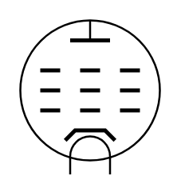

# Pentode

## Definition

```
{
  _style: { 
    entity: 'verticalLabelPosition=bottom;shadow=0;dashed=0;align=center;html=1;verticalAlign=top;shape=mxgraph.electrical.thermionic_devices.pentode;',
  },
  _original_width: 70,
  _original_height: 77,
}
```

## Usage

```
import { Pentode } from '@dinghy/standard-components-diagrams/electricalVacuumTubes'

<Pentode/>
```

## Preview


