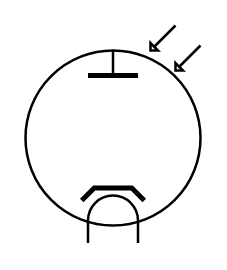

# Photocell

## Definition

```
{
  _style: { 
    entity: 'verticalLabelPosition=bottom;shadow=0;dashed=0;align=center;html=1;verticalAlign=top;shape=mxgraph.electrical.thermionic_devices.photocell;',
  },
  _width: 70,
  _height: 87,
}
```

## Usage

```
import { Photocell } from '@diac/standard-components-diagrams/electricalVacuumTubes'

<Photocell/>
```

## Preview


