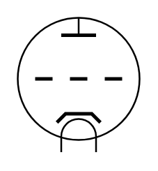

# Triode

## Definition

```
{
  _style: 'verticalLabelPosition=bottom;shadow=0;dashed=0;align=center;html=1;verticalAlign=top;shape=mxgraph.electrical.thermionic_devices.triode;',
  _width: 70,
  _height: 77,
}
```

## Usage

```
import { Triode } from '@reactiac/standard-components-diagrams/electricalVacuumTubes'

<Triode/>
```

## Preview


