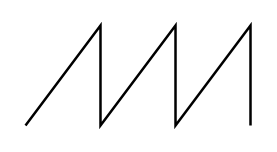
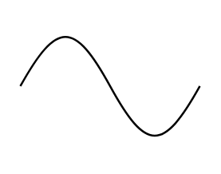

# Electrical Waveforms Entities

- [ChoppedSquareWave](./chopped-square-wave.md)  

- [Pulse](./pulse.md)  

- [Pulse2](./pulse-2.md)  

- [Sawtooth](./sawtooth.md)  

- [SineWave](./sine-wave.md)  

- [SquareWave](./square-wave.md)  

- [Step](./step.md)  

- [Step2](./step-2.md)  

