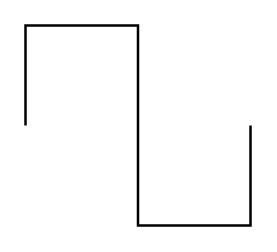

# square_wave

## Definition

```
{
  _style: 'pointerEvents=1;verticalLabelPosition=bottom;shadow=0;dashed=0;align=center;html=1;verticalAlign=top;shape=mxgraph.electrical.waveforms.square_wave;',
  _width: 90,
  _height: 80,
}
```

## Usage

```
import { SquareWave } from '@reactiac/standard-components-diagrams/electricalWaveforms'

<SquareWave/>
```

## Preview


