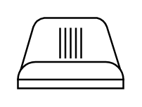

# CRT TV

## Definition

```
{
  _style: { 
    entity: 'verticalLabelPosition=bottom;html=1;verticalAlign=top;align=center;shape=mxgraph.floorplan.crt_tv;',
  },
  _width: 60,
  _height: 40,
}
```

## Usage

```
import { CrtTv } from '@diac/standard-components-diagrams/floorPlans'

<CrtTv/>
```

## Preview


