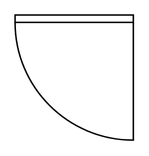

# Door 2

## Definition

```
{
  _style: 'verticalLabelPosition=bottom;html=1;verticalAlign=top;align=center;shape=mxgraph.floorplan.doorRight;aspect=fixed;',
  _width: 80,
  _height: 85,
}
```

## Usage

```
import { Door2 } from '@diac/standard-components-diagrams/floorPlans'

<Door2/>
```

## Preview


