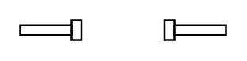

# Door, Double Pocket

## Definition

```
{
  _style: 'verticalLabelPosition=bottom;html=1;verticalAlign=top;align=center;shape=mxgraph.floorplan.doorDoublePocket;dx=0.25;',
  _width: 104,
  _height: 10,
}
```

## Usage

```
import { DoorDoublePocket } from '@reactiac/standard-components-diagrams/floorPlans'

<DoorDoublePocket/>
```

## Preview


