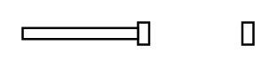

# Door, Pocket

## Definition

```
{
  _style: { 
    entity: 'verticalLabelPosition=bottom;html=1;verticalAlign=top;align=center;shape=mxgraph.floorplan.doorPocket;dx=0.5;',
  },
  _original_width: 104,
  _original_height: 10,
}
```

## Usage

```
import { DoorPocket } from '@dinghy/standard-components-diagrams/floorPlans'

<DoorPocket/>
```

## Preview


