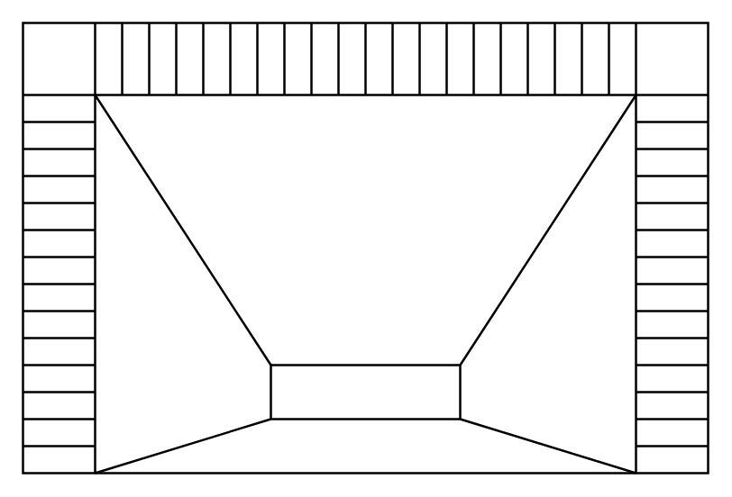

# Fireplace

## Definition

```
{
  _style: 'verticalLabelPosition=bottom;html=1;verticalAlign=top;align=center;shape=mxgraph.floorplan.fireplace;',
  _width: 304,
  _height: 200,
}
```

## Usage

```
import { Fireplace } from '@diac/standard-components-diagrams/floorPlans'

<Fireplace/>
```

## Preview


