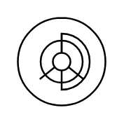

# Floor Lamp

## Definition

```
{
  _style: 'verticalLabelPosition=bottom;html=1;verticalAlign=top;align=center;shape=mxgraph.floorplan.floor_lamp;',
  _width: 50,
  _height: 50,
}
```

## Usage

```
import { FloorLamp } from '@reactiac/standard-components-diagrams/floorPlans'

<FloorLamp/>
```

## Preview


