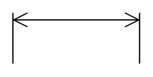

# Horizontal Dimension 2

## Definition

```
{
  _style: { 
    entity: 'shape=dimension;direction=west;whiteSpace=wrap;html=1;align=center;points=[];verticalAlign=top;spacingTop=-15;labelBackgroundColor=none;',
  },
  _width: 100,
  _height: 40,
}
```

## Usage

```
import { HorizontalDimension2 } from '@diac/standard-components-diagrams/floorPlans'

<HorizontalDimension2/>
```

## Preview


