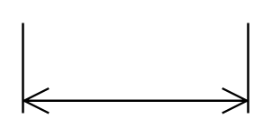

# Horizontal Dimension

## Definition

```
{
  _style: { 
    entity: 'shape=dimension;whiteSpace=wrap;html=1;align=center;points=[];verticalAlign=bottom;spacingBottom=3;labelBackgroundColor=none;',
  },
  _original_width: 100,
  _original_height: 40,
}
```

## Usage

```
import { HorizontalDimension } from '@diac/standard-components-diagrams/floorPlans'

<HorizontalDimension/>
```

## Preview


