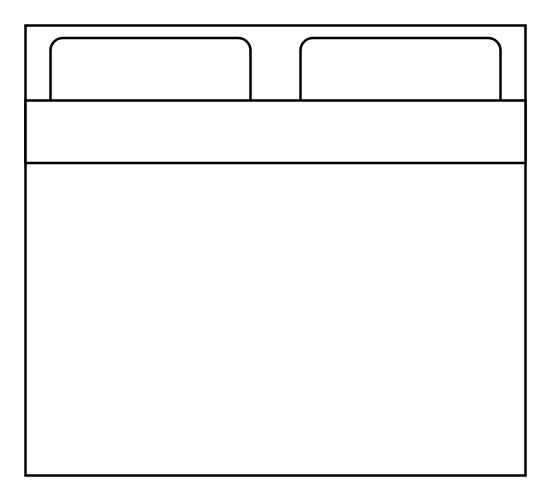

# Other Floorplans Entities

- [Bathtub](./bathtub.md)  

- [BedSingle](./bed-single.md)  

- [BedDouble](./bed-double.md)  

- [Bookcase](./bookcase.md)  

- [Chair](./chair.md)  

- [Copier](./copier.md)  

- [Couch](./couch.md)  

- [CrtTv](./crt-tv.md)  

- [DeskCorner](./desk-corner.md)  

- [DeskCorner2](./desk-corner-2.md)  

- [Door](./door.md)  

- [Door2](./door-2.md)  

- [DoorAccordion](./door-accordion.md)  

- [DoorBiFold](./door-bi-fold.md)  

- [DoorByPass](./door-by-pass.md)  

- [DoorDouble](./door-double.md)  

- [DoorDoubleAction](./door-double-action.md)  

- [DoorDoublePocket](./door-double-pocket.md)  

- [DoorOpposing](./door-opposing.md)  

- [DoorOverhead](./door-overhead.md)  

- [DoorPocket](./door-pocket.md)  

- [DoorRevolving](./door-revolving.md)  

- [DoorSlidingglass](./door-slidingglass.md)  

- [DoorUneven](./door-uneven.md)  

- [Dresser](./dresser.md)  

- [Elevator](./elevator.md)  

- [Fireplace](./fireplace.md)  

- [FlatTv](./flat-tv.md)  

- [FloorLamp](./floor-lamp.md)  

- [HorizontalDimension](./horizontal-dimension.md)  

- [HorizontalDimension2](./horizontal-dimension-2.md)  

- [KitchenTable](./kitchen-table.md)  

- [KitchenTable2](./kitchen-table-2.md)  

- [KitchenTable3](./kitchen-table-3.md)  

- [Laptop](./laptop.md)  

- [OfficeChair](./office-chair.md)  

- [OfficeTable](./office-table.md)  

- [OfficeTable2](./office-table-2.md)  

- [OfficeTable3](./office-table-3.md)  

- [OfficeTable4](./office-table-4.md)  

- [OfficeTable5](./office-table-5.md)  

- [Opening](./opening.md)  

- [Piano](./piano.md)  

- [Plant](./plant.md)  

- [Printer](./printer.md)  

- [Range1](./range-1.md)  

- [Range2](./range-2.md)  

- [Refrigerator](./refrigerator.md)  

- [Room](./room.md)  

- [RoundKitchenTable](./round-kitchen-table.md)  

- [Shower](./shower.md)  

- [Sink1](./sink-1.md)  

- [Sink2](./sink-2.md)  

- [SinkDouble](./sink-double.md)  

- [SmallKitchenTable](./small-kitchen-table.md)  

- [SmallKitchenTable2](./small-kitchen-table-2.md)  

- [SmallKitchenTable3](./small-kitchen-table-3.md)  

- [Sofa](./sofa.md)  

- [SpiralStairs](./spiral-stairs.md)  

- [Stairs](./stairs.md)  

- [Stairs2](./stairs-2.md)  

- [Stairs3](./stairs-3.md)  

- [Table](./table.md)  

- [Toilet](./toilet.md)  

- [VerticalDimension](./vertical-dimension.md)  

- [VerticalDimension2](./vertical-dimension-2.md)  

- [WallCornerNe](./wall-corner-ne.md)  

- [WallCornerNw](./wall-corner-nw.md)  

- [WallCornerSe](./wall-corner-se.md)  

- [WallCornerSw](./wall-corner-sw.md)  

- [WallHorizontal](./wall-horizontal.md)  

- [WallU](./wall-u.md)  

- [WallVertical](./wall-vertical.md)  

- [WaterCooler](./water-cooler.md)  

- [Window](./window.md)  

- [WindowBay](./window-bay.md)  

- [WindowBow](./window-bow.md)  

- [WindowGarden](./window-garden.md)  

- [WindowGlider](./window-glider.md)  

- [Workstation](./workstation.md)  

