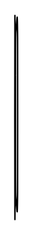

# Kitchen table 2

## Definition

```
{
  _style: { 
    entity: 'verticalLabelPosition=bottom;html=1;verticalAlign=top;align=center;shape=mxgraph.floorplan.chair;shadow=0;direction=north;',
  },
  _original_width: 2,
  _original_height: 140,
}
```

## Usage

```
import { KitchenTable2 } from '@dinghy/standard-components-diagrams/floorPlans'

<KitchenTable2/>
```

## Preview


