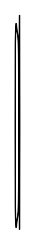

# Kitchen table 3

## Definition

```
{
  _style: { 
    entity: 'verticalLabelPosition=bottom;html=1;verticalAlign=top;align=center;shape=mxgraph.floorplan.chair;shadow=0;direction=south',
  },
  _original_width: 3,
  _original_height: 140,
}
```

## Usage

```
import { KitchenTable3 } from '@dinghy/standard-components-diagrams/floorPlans'

<KitchenTable3/>
```

## Preview


