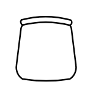

# Office Chair

## Definition

```
{
  _style: { 
    entity: 'verticalLabelPosition=bottom;html=1;verticalAlign=top;align=center;shape=mxgraph.floorplan.office_chair;',
  },
  _width: 40,
  _height: 43,
}
```

## Usage

```
import { OfficeChair } from '@diac/standard-components-diagrams/floorPlans'

<OfficeChair/>
```

## Preview


