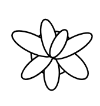

# Plant

## Definition

```
{
  _style: 'verticalLabelPosition=bottom;html=1;verticalAlign=top;align=center;shape=mxgraph.floorplan.plant;',
  _width: 47,
  _height: 51,
}
```

## Usage

```
import { Plant } from '@reactiac/standard-components-diagrams/floorPlans'

<Plant/>
```

## Preview


