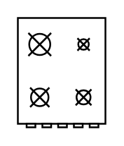

# Range 1

## Definition

```
{
  _style: 'verticalLabelPosition=bottom;html=1;verticalAlign=top;align=center;shape=mxgraph.floorplan.range_1;',
  _width: 50,
  _height: 62,
}
```

## Usage

```
import { Range1 } from '@diac/standard-components-diagrams/floorPlans'

<Range1/>
```

## Preview


