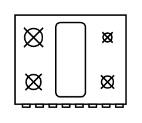

# Range 2

## Definition

```
{
  _style: 'verticalLabelPosition=bottom;html=1;verticalAlign=top;align=center;shape=mxgraph.floorplan.range_2;',
  _width: 75,
  _height: 62,
}
```

## Usage

```
import { Range2 } from '@reactiac/standard-components-diagrams/floorPlans'

<Range2/>
```

## Preview


