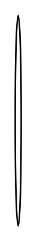

# Round kitchen table

## Definition

```
{
  _style: { 
    entity: 'shape=ellipse;shadow=0;html=1;',
  },
  _original_width: 4,
  _original_height: 140,
}
```

## Usage

```
import { RoundKitchenTable } from '@dinghy/standard-components-diagrams/floorPlans'

<RoundKitchenTable/>
```

## Preview


