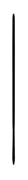

# Small kitchen table 2

## Definition

```
{
  _style: 'verticalLabelPosition=bottom;html=1;verticalAlign=top;align=center;shape=mxgraph.floorplan.chair;shadow=0;rotation=180;',
  _width: 1,
  _height: 120,
}
```

## Usage

```
import { SmallKitchenTable2 } from '@reactiac/standard-components-diagrams/floorPlans'

<SmallKitchenTable2/>
```

## Preview


