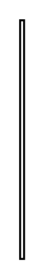

# Small kitchen table 3

## Definition

```
{
  _style: { 
    entity: 'shape=rect;shadow=0;html=1;',
  },
  _original_width: 2,
  _original_height: 120,
}
```

## Usage

```
import { SmallKitchenTable3 } from '@dinghy/standard-components-diagrams/floorPlans'

<SmallKitchenTable3/>
```

## Preview


