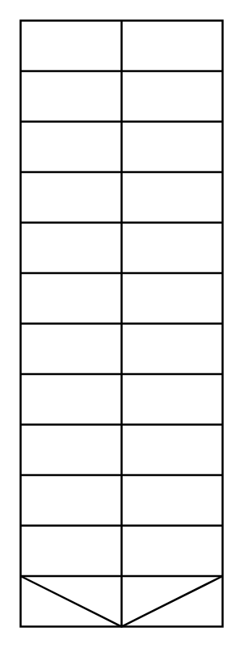

# Stairs 2

## Definition

```
{
  _style: 'verticalLabelPosition=bottom;html=1;verticalAlign=top;align=center;shape=mxgraph.floorplan.stairs;direction=south;',
  _width: 100,
  _height: 300,
}
```

## Usage

```
import { Stairs2 } from '@reactiac/standard-components-diagrams/floorPlans'

<Stairs2/>
```

## Preview


