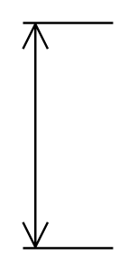

# Vertical Dimension 2

## Definition

```
{
  _style: { 
    entity: 'shape=dimension;direction=south;whiteSpace=wrap;html=1;align=center;points=[];verticalAlign=top;labelBackgroundColor=none;horizontal=0;spacingTop=-15;',
  },
  _width: 40,
  _height: 100,
}
```

## Usage

```
import { VerticalDimension2 } from '@diac/standard-components-diagrams/floorPlans'

<VerticalDimension2/>
```

## Preview


